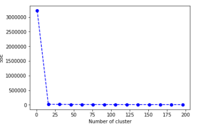
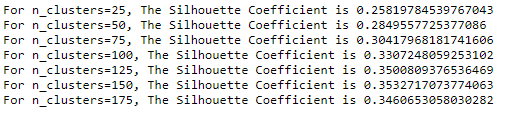

# JobFitt
### http://jobfitt.herokuapp.com/

### Overview
JobFitt is an application that provides the ideal job titles and salary for the title across US for a user based on the skills, education and experience. 

The user input is fed into a machine learning model that has been trained utilizing the O*NET Dataset for the entire US and a proprietary algorithm to find the best match of titles the user is best suited.

The results for the user include the job title, core tasks, technologies needed and the salary for the recommended titles. Also, the latest trends for the year 2018, in terms of job growth, highest growing and declining jobs also has been displayed. 

### Business Problem
With the changing technology trends with automation, analytics, cloud computing and machine learning becoming more popular, it is challenging currently for a fresh graduate or an experienced job seeker to understand the kinds of titles and salaries that would actually map to their current skills. They end-up feeding the same info to multiple sites and apply on different sites. 

It would help:
*   The job seeker to understand the value of their skills more and target their job application process. 
*   Check out Current trends within US 
*   Get access to data

Eventually, this would help the entire recruiting ecosystem that includes company career sites, job boards, applicant tracking systems, and staffing agencies to improve site engagement and candidate conversion.

### Method to our Madness!
* Step 1: Complete the questionnaire with your
    * Skills
	* Education
	* Work Experience
	* Contact Information
  The user input is stored into MongoDB.
* Step 2: K-Means Clustering Machine Learning model processes the user input skills to predict a list of most likely job titles.
* Step 3: The output from the model is passed into a scoring algorithm using weightages to score user’s education and experience against the preprocessed dataset from O*NET. 
* Step 4:The list of predicted titles is sorted in descending order based on the scoring algorithm.
* Step 5: Additional information such as job description, technology, skills, core tasks, expected and alternate titles is retrieved from the dataset for the sorted job titles and the output file is generated. 
* Step 6: The output file is utilized to display the results and create visualizations using Plotly, D3 and SVG. 

### Tools and Technologies used: 
*   Languages: Python, JavaScript, HTML/CSS
*   Language Technologies: 
    * Pandas 
    * Flask-Python Application 
    * PyMongo 
    * JQuery AJAX(Pass user input from client side to server side and get response from server) 
    * Bootstrap
    * Plotly
    * D3 and SVG 
*   Machine Learning Algorithms using SkLearn and Pickle
    * K-Means Clustering 
    * Random Forest Algorithm 
    * Deep Machine Learning 
*   Database: MongoDB

### Dataset links and other links:
The main datasets used: 
*   **O*Net Resource Center**
    Available: https://www.onetcenter.org/db_releases.html
*   **Bureau of Labor Statistics** 
    Available: https://www.bls.gov
*   **Glassdoor (2017) Local Pay Reports: Historical Data**
    Available: https://www.glassdoor.com/research/data-sets/

### Our Takeaways
1. Trends show that the Jobs are growing and we are looking to see more of robotics and automation replacing the secretary and admin jobs

2. There is difference in job growth in numbers vs salary growth in those careers 

3. Certain skills and jobs seem to indicate job patterns (geographically) where they seem to be spread 

### KMeans Clustering

   Determining the **optimal number of clusters** in a data set is a fundamental issue in partitioning clustering, such as k-means clustering which requires the user to specify the number of clusters k to be generated. We used two approaches.

   #### Elbow Method

   1. The Elbow method looks at the total WSS[within-cluster sum of square ] as a function of the number of clusters

   2. One should choose a number of clusters so that adding another cluster doesn’t improve much better the total WSS. 

   3. The total WSS measures the compactness of the clustering and we want it to be as small as possible.

      

   #### Average silhouette method

      1. Average silhouette method measures the quality of a clustering.
      2. A high average silhouette width indicates a good clustering.

   

### Why predict and scoring algorithm ?(Why not ML)

The Machine Learning Algorithm did not provide the needed accuracy due to which we developed our own prediction algorithm. 

The Accuracy obtained for different algorithms is as mentioned below:
1. Deep Learning : Accuracy(18%)
2. Random Forest: Accuracy(75%)

### Next Steps!

*   Gather and create a large datasets to replace second step of our proprietary algorithm with a Neural Network machine learning model like Random Forest and Deep Machine Learning.
*   For Trends page - Do web scraping dynamically from other websites to get latest news and display on trends page .
*   Provide Search functionality .
*   Include a functionality to upload the Resume in pdf format and do NLP to retrieve skills for predicting best jobs.

### Roadmap
*   Application would suggest positions available right now in careers websites that map the title and salaries that were suggested 
*   Find what skill gaps to be updated to achieve the job position needs for a job seeker. 

### Our Team:

* Aiyanna Liz Mathew	
* Anu Khandelwal 
* Aruna Amaresan	
* Aswathy Mohan
* Pallavi Donwad
